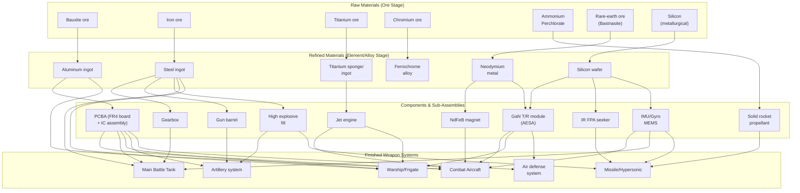
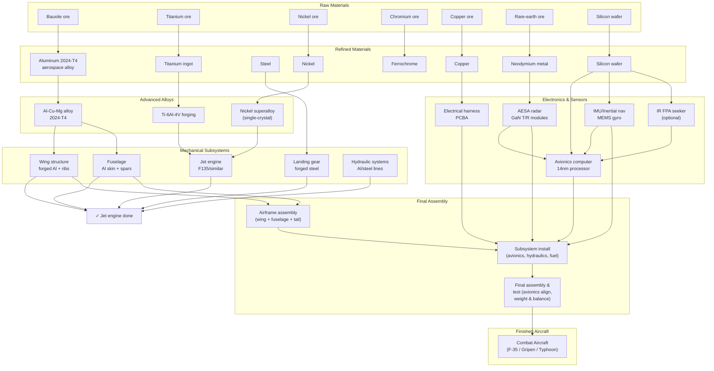
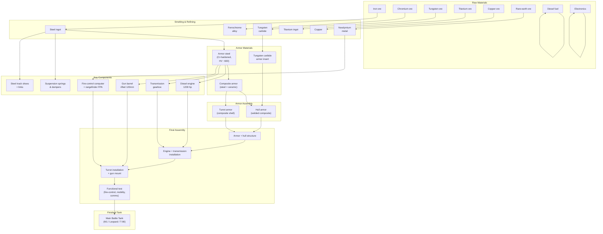
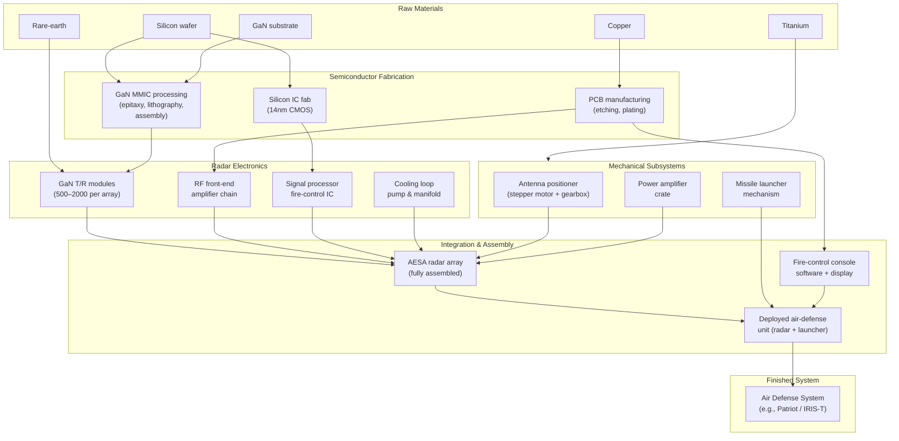

# Military Electronics & Advanced Components: Production Chains and Dependencies
## A Reference for Game Design

**Sourcing note:** This document was compiled with live web research (July 2026) covering semiconductor manufacturing, advanced materials production, and military electronics. Information is drawn from defense industry, academic sources, and USPTO technical documents. This is a design-reference document complementing `reference-military-production.md`; it does NOT duplicate raw-materials coverage but focuses on the electronics and advanced component layer beneath finished weapon systems.

---

## 1. Military Semiconductors & Fabrication

Modern military electronics depend on specialized semiconductor fabrication. Unlike civilian chipmaking, military semiconductor production emphasizes radiation hardness, temperature stability, and reliability over raw performance.

### 1.1 Semiconductor Fabrication Fundamentals

**Wafer production chain:**
```
Metallurgical-grade silicon (98% purity)
  ↓
Purification (Czochralski/Siemens process) → Polysilicon feedstock
  ↓
Crystal ingot growing (Czochralski furnace, 1400°C) → Ingot (300mm diameter ~650mm tall)
  ↓
Wafer slicing (diamond wire saw, 0.3mm kerf loss) → Wafer blanks
  ↓
Wafer polishing (chemical–mechanical polish) → Finished wafers
  ↓
[Ready for fab processing]
```

**Fab processing (node-dependent, illustrated for ~65nm–7nm):**
- **Oxidation:** Wafer heated in oxygen atmosphere (SiO₂ growth on surface).
- **Photolithography:** Photoresist applied → UV/extreme-ultraviolet (EUV) exposure through mask → development → pattern transfer.
- **Doping:** Implantation or diffusion of dopants (boron, phosphorus, arsenic) into semiconductor to create p/n junctions.
- **Etch:** Reactive ion etch (RIE) to remove unwanted material (silicon, oxide, nitride) using fluorine-based or chlorine-based plasma.
- **Deposition:** Chemical-vapor deposition (CVD) or physical-vapor deposition (PVD) of metals, oxides, nitrides for interconnects and gates.
- **Repeat:** These steps cycle 20–50 times depending on metal layers and complexity.

**Key constraint:** Immersion lithography (≤7nm nodes) requires extreme-ultraviolet (EUV) light sources (Laser Plasma Source, LPS, at 13.5 nm wavelength). EUV steppers cost $150–200 million each; only ASML manufactures them; lead time 2–3 years; only 100–200 units produced globally per year. This is the **primary chokepoint** for sub-7nm military semiconductor scaling.

**Semiconductor nodes relevant to military:**
- **65nm–28nm:** Analog, power, RF (radar, communications). Mature process nodes; multiple fabs worldwide; less constrained.
- **14nm–7nm:** High-performance processors (fire control, targeting computers), RF (GaN MMIC base layers). Concentrated in Taiwan (TSMC), South Korea (Samsung), USA (Intel). Lead times 6–12 months even for military priority. Geopolitically concentrated.
- **5nm and below:** Advanced AI, signal processing. TSMC and Samsung only; reserved for highest-priority applications; lead times 12–24 months.

### 1.2 Gallium Nitride (GaN) and Silicon Carbide (SiC) Semiconductors

Military radar, power converters, and RF systems rely on wide-bandgap semiconductors for high-temperature, high-power operation.

**GaN (Gallium Nitride):**
- **Primary use:** T/R modules in AESA radar, RF power amplifiers, military communications.
- **Substrate:** GaN grown on SiC substrate (epitaxy) or sapphire (Al₂O₃).
- **Process node:** 250 nm GaN-on-SiC HEMT (High Electron Mobility Transistor) is current military standard.
- **Manufacturing steps:**
  - SiC substrate (or sapphire) as base → thermal oxidation to create buffer layer.
  - Epitaxial growth of GaN layer (300–600 nm thick) using MOCVD (metal-organic chemical vapor deposition) or HVPE (hydride vapor-phase epitaxy) at 1000°C+.
  - Mesa etch to define active device area.
  - Ohmic contact formation (Ti/Al/Ni/Au stack, annealing to 600–800°C).
  - Schottky gate formation (Ni-based gate, typically 0.5–1.0 μm length for 250 nm process).
  - Passivation (SiN or SiO₂) to manage surface charge traps.
  - Metallization (multi-layer interconnects, Al/Ti/Au).
  - Assembly into MMIC (Monolithic Microwave Integrated Circuit).
- **Assembly into T/R module:** 250–500 individual T/R modules per AESA radar array; each module contains power amplifier, low-noise amplifier, switch, and bias circuitry.
- **Key bottleneck:** GaN epitaxy (MOCVD) capacity is limited; only Korea (Wavice/ETRI), USA (Wolfspeed, MACOM), Europe (power-device fabs) have mature production. Lead time 6–12 months for volume orders.

**SiC (Silicon Carbide):**
- **Primary use:** Power converters (inverters, rectifiers), high-temperature engine control electronics.
- **Substrate:** 4H-SiC polytype, produced in wafer sizes up to 8-inch (200 mm).
- **Manufacturing steps:**
  - SiC bulk growth (Acheson process or seeded sublimation) at 2000°C+ in graphite crucible to grow ingot.
  - Ingot slicing (diamond wire saw, high kerf loss due to SiC hardness).
  - Wafer polishing (abrasive slurry, much slower than silicon due to hardness).
  - Epitaxial growth (CVD of SiC at 1500–1600°C in H₂/SiH₄/C₂H₆ atmosphere).
  - Device fabrication (implant, etch, metallization, similar to Si but at higher T).
- **Key bottleneck:** Wafer polishing and epitaxy are slow; production cost 3–5x higher than silicon. Capacity concentrated at Wolfspeed (USA), Onsemi (USA), and a few European fabs. Lead time 9–18 months.

### 1.3 Integrated Circuits for Military Systems

**Radiation-hardened ICs (rad-hard chips):**
- Used in space, airborne, and high-radiation environments (close to nuclear detonations, EMP exposure).
- Manufactured using older (65nm–130nm) process nodes for proven reliability.
- Cost premium: 5–10x over equivalent commercial-off-the-shelf (COTS) ICs.
- Lead time: 12–24 months (includes extensive qualification testing).
- Key suppliers: Microsemi (USA), Atmel (USA), Xilinx (US, now AMD).

**Fire control & targeting processors:**
- Typically 14nm–28nm process nodes.
- Specialized designs (FPGA, DSP, CPU hybrid) for signal processing and targeting algorithms.
- Production in Taiwan (TSMC) or USA (Intel, via trusted foundry programs).
- Lead time: 6–12 months.

---

## 2. Electro-Optical & Sensor Systems

### 2.1 AESA Radar (Active Electronically Scanned Array)

**AESA radar architecture:**
- **T/R module array:** 500–2000+ phased-array elements per radar, each containing:
  - GaN power amplifier (transmit).
  - GaN low-noise amplifier (receive).
  - RF switch (transmit/receive path select).
  - Beam-steering phase shifter (sometimes integrated in MMIC, sometimes hybrid).
  - Bias and signal conditioning (small-signal silicon IC).

**Production chain (one T/R module):**
```
SiC substrate → GaN epitaxy → MMIC processing → GaN T/R chip
                                                      ↓
RF packaging (ceramic hybrid, wire bonding, testing) → Assembled T/R module
                                                      ↓
500–2000 modules (parallel assembly) → AESA array integration
                                    (RF interconnects, cooling manifold)
                                                      ↓
Radar front-end (antenna, RF distribution, amplifiers) → Complete radar system
```

**Bottleneck:** GaN MMIC production. A single modern fighter has one AESA radar with 1500+ T/R modules. Annual production of 100 fighters requires 150,000+ T/R modules. Current global GaN MMIC capacity is 50,000–100,000 modules/year. Scaling requires new epitaxy lines (MOCVD/HVPE): 12–24 months per line, $50–100M per line.

### 2.2 Infrared (Thermal Imaging) & EO/IR Seekers

**Focal Plane Array (FPA) sensor:**
- **Technology:** Quantum detector (InSb—Indium Antimonide, or MCT—Mercury Cadmium Telluride) or thermal uncooled microbolometer.
- **Quantum detectors (e.g., InSb):**
  - High sensitivity and fast response.
  - Require cryogenic cooling (liquid nitrogen ~77K or thermoelectric cooler).
  - Pixel sizes: 15–30 μm.
  - Typical resolution: 320×256 to 640×512 pixels.
  - Manufacturing: Epitaxial growth of InSb on CdTe buffer on GaAs substrate; hybridization to CMOS readout IC via indium-bump bonding.
  
- **Uncooled microbolometers (CMOS-based):**
  - Room-temperature operation (no cryogenic cooler).
  - Lower sensitivity, slower response.
  - Smaller pixel pitch (12–17 μm achievable).
  - Manufacturing: Fabricated on post-processed CMOS wafers (resistive or vanadium-oxide pixel layer deposited after CMOS logic).
  - Significantly lower cost; rapidly displacing cooled FPAs for tactical systems.

**IR seeker production chain (typical missile guidance FPA):**
```
Indium antimonide ingot (Czochralski growth) → Wafer slicing/polish
                                                   ↓
            Epitaxial layer growth (CdTe buffer, InSb active) → FPA focal plane wafer
                                                   ↓
             Hybridization with CMOS readout IC (indium-bump bonding) → Hybridized FPA
                                                   ↓
              FPA assembly into dewar (thermal enclosure, cold finger) → Sealed sensor head
                                                   ↓
                  Signal processing electronics (front-end amplifier, A/D converter) → EO/IR seeker
```

**Bottleneck:** FPA wafer production (epitaxy for InSb) is concentrated in USA (Teledyne), Israel (SCD), and Europe (Sofradir). Annual capacity ~50,000–100,000 FPAs globally. A modern air-to-air missile needs 1 FPA; sea-launched antiship missile, 1–2. Annual US/NATO missile production target (2025+): 10,000+/year, implying FPA shortage. Uncooled microbolometer production is scaling faster (higher volume, lower cost).

### 2.3 Inertial Measurement Units (IMU) & MEMS Gyroscopes

**MEMS inertial sensors (accelerometer & gyroscope):**
- Manufacturing: Standard CMOS-MEMS fabrication process.
- Gyroscope principle: Vibrating proof mass; Coriolis force deflection measured as output signal.
- Accelerometer: Suspended proof mass on springs; displacement proportional to acceleration.

**Production chain:**
```
Silicon wafer → CMOS logic layer processing (transistors, interconnect)
                    ↓
         Post-CMOS mechanical layer release (deep reactive ion etch, DRIE)
                    ↓
           Trench etch → Released proof mass / vibrating structure
                    ↓
           Metallization → Packaging (ceramic or BGA plastic, wire bonding)
                    ↓
         MEMS accelerometer & gyroscope (integrated IMU)
```

**Key advantage:** Mature IC process → 10,000 MEMS devices fabricated as easily as one. Cost per device ~$5–50 (tactical grade) to $200–500 (space-grade). Capacity not rate-limited by fab; assembly and testing are the pacing items.

**Tactical IMU performance:** ±16g acceleration range, 200–1000°/s angular rate, 1–2° bias stability (typical for missile guidance, UAV autopilot).

### 2.4 GPS & Guidance Electronics

**GPS receiver module:**
- Contains RF front-end (GPS L1/L2/L5 filters), GPS receiver IC (12–16nm process node), TCXO (temperature-compensated crystal oscillator), antenna interface.
- Typical power: 0.5–2 W.
- Production: Taiwan (MediaTek, Broadcom, Qualcomm subcontractors) or USA (Garmin, Trimble fabs).
- Lead time: 4–8 weeks for standard military-grade modules.

**Inertial Navigation System (INS):**
- High-grade IMU (drift rate <0.5°/hour, bias stability <0.01°/hour) + processing electronics.
- INS + GPS integration: Loosely or tightly coupled filter (Kalman filter, running on embedded processor).
- Tactical INS/GPS: $10k–50k per unit; strategic systems: $500k–$5M (ring-laser gyro or fiber-optic gyro based).

---

## 3. Critical Mechanical Components & Materials

### 3.1 Jet Engines

Jet engines are the pacing item for fighter aircraft production. A single engine contains 500–1000 precision parts. Lead time: 18–36 months from order to delivery for a new production lot.

**Engine architecture overview:**
- **Fan:** Low-pressure compressor, inlet airflow (1–3 stages).
- **Compressor:** Multi-stage axial compressor (10–15 stages), pressure ratio 20–40:1.
- **Combustor:** Fuel injection, high-temperature combustion (~1700K).
- **Turbine:** High-pressure (HPT) and low-pressure (LPT) turbines, multi-stage, temperatures 1400–1600K.
- **Nozzle:** Exhaust expansion & thrust vectoring.

**Materials by section:**
- **Fan blades:** Titanium alloy (Ti-6Al-4V), cast or forged.
- **Compressor blades (low-stage):** Titanium alloy (Ti-6Al-2Sn-4Zr-2Mo), forged.
- **Compressor blades (high-stage):** Nickel superalloy (e.g., René 77D, single-crystal cast).
- **HPT blades:** Single-crystal nickel-cobalt superalloy (e.g., CMSX-4, PWA 1480), directionally solidified or single-crystal casting, 60–80% of turbine blade cost.
- **Casings:** Aluminum alloy (compressor), steel or nickel alloy (turbine).

**Production chain (simplified, one compressor stage):**
```
Titanium ingot (vacuum re-melted) → Forging (die press)
                                        ↓
                          Rough machining (5-axis mill)
                                        ↓
                          Heat treatment (solution + aging)
                                        ↓
                          Precision finishing (honing, polish)
                                        ↓
                          Blade testing (NDT: ultrasonic, eddy current, X-ray)
                                        ↓
                              Finished blade
```

**HPT blade production (single-crystal casting):**
```
Nickel alloy ingot (powder metallurgy or vacuum melt)
                                        ↓
                          Casting mold design (ceramic shell)
                                        ↓
                          Directional solidification (DS) furnace: controlled thermal gradient, withdrawal rate 10–50 mm/hr
                                        ↓
                          Single-crystal casting (Bridgman process or liquid-metal-cooled casting)
                                        ↓
                          HIP (hot isostatic pressing) to close internal voids
                                        ↓
                          Solution heat treat (1300°C) + aging (650–900°C)
                                        ↓
                          Precision machining (airfoil contour CNC mill)
                                        ↓
                          Thermal barrier coating (TBC: YSZ—yttria-stabilized zirconia, 0.5–1.5 mm thick)
                                        ↓
                              Production-ready HPT blade
```

**Cost:** HPT blade: $30,000–$50,000 each; an engine needs 75–150 HPT blades. A fighter aircraft engine (F135 in F-35) costs $40–50M; roughly 2–3 years of skilled manufacturing labor.

**Bottleneck:** Single-crystal casting capacity and machine tools. A single DS furnace produces ~50 HPT blades per day; one fighter engine requires 100+ blades total. Annual US jet-engine production: 400–600 military engines/year (fighters, helicopters, transport). Scaling requires new foundries (18–24 months, $500M–$1B investment).

### 3.2 Diesel Engines (Army & Naval)

**Tank & APC diesel engines:**
- Typical: 4-stroke, turbocharged V-12 or inline-6, 1000–1500 hp @ 2200 rpm.
- Examples: MTU MB 883 (Merkava tank), Caterpillar 3512 (naval), MAN D2842 (marine).
- Pressure: 200+ bar peak combustion pressure; turbocharger boost 2–3 bar.

**Production chain:**
```
Iron ore → Blast furnace → Pig iron → EAF steel → Ingot
                                            ↓
                      Forging (engine block blank) → Rough casting
                                            ↓
                      CNC machining (cylinders, ports, galleries)
                                            ↓
                      Cylinder boring & honing (tight tolerance ±0.05 mm)
                                            ↓
                      Cylinder liners (cast iron or steel, shrink-fit)
                                            ↓
                      Crankshaft forging (alloy steel) → balancing & finishing
                                            ↓
                      Connecting rod (forged steel) → precision machining
                                            ↓
                      Piston (aluminum alloy) → ring grooves machining
                                            ↓
                      Head casting (ductile iron or aluminum alloy)
                                            ↓
                      Valve seats & valve train assembly
                                            ↓
                      Turbocharger assembly (compressor wheel, turbine wheel)
                                            ↓
                      Fuel injector assembly (precision nozzles, 1–3 μm tolerances)
                                            ↓
                      Assembly (block → crankshaft → pistons/rods → head → seals/gaskets)
                                            ↓
                      Testing (cold start, full-load, oil-pressure verification)
                                            ↓
                          Production-ready diesel engine
```

**Key bottleneck:** Precision machining (cylinder boring, crankshaft balancing) and turbocharger assembly. A diesel-engine factory produces 50–200 engines/month at full capacity. Tank production (18–24 tanks/month in wartime) is constrained by engine supply. Marine engines are slower: 10–20 naval diesel engines/year per builder.

### 3.3 Gearboxes & Transmissions

**Tank & vehicle transmissions:**
- Typical: Manual or automatic gearbox with 5–8 forward gears, synchronized mesh.
- Ratio spread: 10:1 to 20:1 (low to high gear).
- Torque capacity: 1000–3000 N·m (military vehicles under peak engine load).

**Gear manufacturing chain (per gear):**
```
Steel ingot (alloy steel, e.g., 18CrNiMo7-6) → Forging (near-net-shape blank)
                                                      ↓
                                      CNC pre-machining (bore, OD facing)
                                                      ↓
                                      Hobbing (cutting teeth; 180–220 BHN hardness)
                                                      ↓
                                      Rough shaving (finishing, 0.5–2 mm stock left)
                                                      ↓
                                      Case hardening (carburizing: 850–950°C, 4–8 hr, carbon diffusion depth 0.8–1.5 mm)
                                                      ↓
                                      Hardening quench (oil quench to 58–62 HRC)
                                                      ↓
                                      Fine shaving & grinding (0.05–0.1 mm final finish)
                                                      ↓
                                      Profile & lead inspection (ISO 1328-1:2013 Class 5–6)
                                                      ↓
                                              Production-ready gear
```

**Gearbox assembly:**
```
Multiple gears (3–8 main gears) + shafts (hollow, forged alloy steel)
                                                      ↓
                          Ball/roller bearing installation (preloaded)
                                                      ↓
                          Synchronizer ring assembly (brass, 0.5–1 mm taper surface)
                                                      ↓
                          Housing assembly (ductile iron or aluminum alloy casting)
                                                      ↓
                          Seal, gasket, bearing installation
                                                      ↓
                          Shift linkage assembly
                                                      ↓
                          Fluid fill (transmission oil, 5–15 liters)
                                                      ↓
                          Testing (shift smoothness, leak check, torque-loss measurement)
                                                      ↓
                              Production-ready transmission
```

**Bottleneck:** Hobbing machine tool availability and heat-treatment capacity. A single hobbing machine produces 10–30 gears/day (depending on tooth count, diameter, material). A tank factory needs 100s of gears/month. Industrial heat-treatment ovens (batch or continuous) are slow; case-hardening cycle 8–16 hours per batch.

### 3.4 Gun Barrels (Artillery & Tank Cannons)

**Rifled barrel production (155mm howitzer example):**
```
Steel ingot (alloy steel, e.g., 37Cr4Mo4V) → Forging (barrel blank, wall thickness 40–60 mm)
                                                      ↓
                                      Rough boring (gun drill, 152 mm hole)
                                                      ↓
                                      Reaming (final bore diameter ±0.05 mm, leave 0.1–0.2 mm for honing)
                                                      ↓
                                      Honing (removes 50–100 μm stock, polishes bore to Ra 0.4–0.8 μm)
                                                      ↓
                      Rifling (48 spiral grooves for 155mm, two options):
                        • Traditional broaching (tool shape matches rifling profile, single pass, fast but inflexible)
                        • Electrochemical machining (ECM: 48 passes, one per groove, 1–5 amp, precise depth control, no tool wear)
                                                      ↓
                                      Chamber & throat ream (precision taper for ammunition fit)
                                                      ↓
                                      Muzzle brake installation (welded or screwed threaded fitting)
                                                      ↓
                                      Proof testing (pressure test: fire proof round, measure bore surface pressure)
                                                      ↓
                                      Internal surface inspection (borescope, eddy-current check for cracks)
                                                      ↓
                                              Production-ready barrel
```

**Key bottleneck:** Precision drilling & honing. Gun-boring mills are specialized, expensive ($5–15M per mill), slow (1 barrel per day). A 155mm ammunition factory needs 50+ barrels/month for gun production. Rifling via ECM is slower but more repeatable; electrochemical machining requires specialized power supplies and tooling (~$2M per ECM mill).

### 3.5 Rare-Earth Permanent Magnets (NdFeB)

Motors, generators, actuators, and radar cooling fans depend on neodymium-iron-boron (NdFeB) permanent magnets. Production is a choke-point for scaling advanced systems.

**Production chain (from rare-earth ore to finished magnet):**
```
Bastnasite ore (typically 5–10% REE content) → Beneficiation (flotation, concentration to 40–60% REE)
                                                      ↓
                      Hydrometallurgical separation (acid leach: HCl or H₂SO₄ at 80–90°C)
                                                      ↓
                      Selective precipitation (alkali precipitation of rare-earth hydroxides)
                                                      ↓
                      Solvent extraction (multi-stage columns, 20–30 equilibrium stages)
                                                      ↓
                      Crystallization & isolation (Neodymium chloride or oxide separation)
                                                      ↓
                      Molten-salt electrolysis (NdCl₃ electrochemically reduced to Nd metal at 750°C)
                                                      ↓
                                  Purified neodymium metal
                                                      ↓
                      [Parallel: Iron from scrap or ingot; Boron from boric acid/borate minerals]
                                                      ↓
                      Vacuum induction melting (Nd + Fe + B at 1200°C, stirred crucible, 1–2 hr per melt)
                                                      ↓
                                  NdFeB alloy ingot
                                                      ↓
                      Strip-casting or jet-casting (rapid solidification → fine grain, ~10 μm crystallite size)
                                                      ↓
                      Powder atomization (hydrogen-atomization mill: ingot shattered into 50–150 μm powder particles)
                                                      ↓
                      Magnetic alignment (powder compacted in mold under strong external field, 1–2 T, to align particles)
                                                      ↓
                      Sintering furnace (pressed powder heated to 1200°C in vacuum, 30–60 minutes, particles weld together)
                                                      ↓
                                  Green magnet (~90% theoretical density)
                                                      ↓
                      Density finishing (eddy-current sorting for bulk density verification)
                                                      ↓
                      Heat treatment (solution anneal 1100°C + precipitation age 200–400°C, develops maximum remanence)
                                                      ↓
                      Surface treatment (electroless nickel plating, 3–10 μm, prevents oxidation)
                                                      ↓
                      Magnetization (charged in capacitor bank discharge, saturates B-H curve to remanent state)
                                                      ↓
                                  Finished NdFeB magnet
```

**Grades & performance:**
- **N35–N52 grades** (tactical use, 260–310 mT remanence, Tc ~310K): 1000–10,000 unit annual production per supplier.
- **Permanent-magnet generator efficiency:** NdFeB magnets are essential for generator efficiency >90%; permanent-magnet DC motors (rare-earth poles) achieve higher power density than wound-field alternatives.

**Bottleneck:** Rare-earth separation. Global production concentrated in China (80%+). Neodymium separation via solvent extraction is slow (multi-stage columns, 20–30 days per batch). A single motor with 4–8 NdFeB magnets requires 20–100 g of neodymium. Annual fighter production (100 aircraft) with 8 NdFeB motors per aircraft = 800 motors = 16–80 kg neodymium demand. US strategic reserve (from stockpiling) holds 2–5 years of military demand; new mine production (Rare Element Resources, etc.) is not yet operational at scale.

---

## 4. Advanced Materials for Weapons & Components

### 4.1 Titanium Supply Chain (Deeper Detail)

**Kroll process for titanium sponge (simplified):**
```
Rutile ore (TiO₂) → Beneficiation (flotation, concentration)
                                                      ↓
                      Chlorination (TiO₂ + Coke + Cl₂ at 800–900°C in fluidized bed)
                                                      ↓
                      Vapor-phase reduction (produce TiCl₄ vapor)
                                                      ↓
                      Titanium tetrachloride (TiCl₄) purification (distillation, remove FeCl₃, AlCl₃)
                                                      ↓
                      Reduction (TiCl₄ + Mg metal at 800–900°C in inert atmosphere)
                                                      ↓
                      Magnesium chloride formed; titanium sponge (porous, 99.5% purity) precipitates
                                                      ↓
                      Acid leach (dilute HCl removes MgCl₂ residue)
                                                      ↓
                      Titanium sponge (ready for melting)
                                                      ↓
                      Vacuum arc remelting (VAR: electrode melted in water-cooled copper crucible, purifies sponge)
                                                      ↓
                                  Titanium ingot (60–100 kg per melt)
                                                      ↓
                      Forging (extrusion or hammer-press at 950–1050°C)
                                                      ↓
                                  Titanium plate / billet
```

**Cost & lead time:**
- Sponge production: 1–2 tons/day per Kroll plant; only 10–15 plants worldwide (USA 3, Japan 2, Kazakhstan 1, China 3, Europe 2).
- Melting & forging: 1–3 months per ingot order.
- A fighter aircraft fuselage needs 500–1000 kg titanium; engine needs 200–400 kg.
- Annual US fighter production (100/year) needs 70–140 tons titanium. Annual global production ~120,000 tons (2024); military demand ~10%.

**Bottleneck:** Kroll process is slow, energy-intensive, and limited by available sponge capacity. Magnesium metal is also a constraint (produced by electrochemical reduction of MgCl₂, energy-intensive). A new Kroll plant takes 3–5 years to build and costs $300M–$500M.

### 4.2 Aerospace Aluminum Alloys (2xxx & 7xxx Series)

**Aluminum alloy production (2024-T4 airframe alloy example):**
```
Bauxite ore → Alumina (Al₂O₃) via Bayer process → Aluminum smelter (Hall-Héroult electrolysis)
                                                      ↓
                      Molten aluminum + Copper (2–5% by wt) + Manganese (0.3–0.9%) + Magnesium (0.4–0.8%)
                                                      ↓
                      Casting (direct-chill casting into ingot mold, 10–30 tons per ingot)
                                                      ↓
                      Homogenizing heat treatment (480–510°C, 12–24 hr, diffuses alloying elements)
                                                      ↓
                      Hot rolling (ingot reduced 90% at 400–450°C, produces slab 50–100 mm thick)
                                                      ↓
                      Solution heat treatment (500°C, 1–2 hr, dissolves strengthening precipitates)
                                                      ↓
                      Quenching (water quench cools alloy rapidly, locks in supersaturated solution)
                                                      ↓
                      Artificial aging (160–190°C, 8–24 hr, precipitation of strengthening phases: θ' → θ-Al₂Cu)
                                                      ↓
                      Cold-rolling finish (to target thickness, work-hardening improves strength)
                                                      ↓
                      Clad layer (if needed: thin pure-aluminum layer <5% thickness) for corrosion resistance
                                                      ↓
                                  Aluminum sheet ready for airframe milling
```

**Performance:**
- 2024-T4: Tensile strength 470 MPa, damage tolerance good (used for wing skins, fuselage).
- 7075-T73: Tensile strength 510 MPa, stress-corrosion cracking resistant via under-aging (T73) (used for high-stress wing roots, landing gear).

**Bottleneck:** Aluminum smelting is energy-intensive (15 MWh per ton); smelter capacity is rate-limiting. Alloying element availability (copper, zinc) can constrain scaling. Lead time for custom alloy ingot: 6–8 weeks.

### 4.3 Composite Materials (Carbon Fiber Airframes, Missile Bodies)

**Carbon fiber production chain:**
```
Precursor polymer (polyacrylonitrile, PAN, or pitch) → Fiber spinning (jet extrusion through nozzles, fine fibers)
                                                      ↓
                      Stabilization (controlled oxidation in air, 200–300°C, converts PAN → aromatic rings)
                                                      ↓
                      Carbonization (high-temperature pyrolysis in inert atmosphere, 1000–1500°C, removes H/N/O)
                                                      ↓
                                  Carbon fiber filament (7–8 μm diameter, 1000s of filaments bundled into tow)
                                                      ↓
                      Surface treatment (coating: sizing, oxidation, or electrolytic deposition, 0.5–2% by weight)
                                                      ↓
                      Weaving/braiding (carbon tows arranged into fabric, twill or plain weave, 100–500 g/m²)
                                                      ↓
                      Prepreg manufacturing (fabric impregnated with epoxy resin, 35–45% resin by weight, cooled to B-stage)
                                                      ↓
                      Composite layup (prepreg plies stacked in mold, oriented at ±45°, 0°, 90° for strength)
                                                      ↓
                      Autoclave curing (pressure-heated oven, 120–180°C, 1–4 hours, cross-links epoxy)
                                                      ↓
                                  Composite laminate (airframe skin, missile fuselage)
```

**Performance:**
- Carbon/epoxy composite: Specific modulus (stiffness/density) 2–3× higher than aluminum; tensile strength 1200–1500 MPa at 40% lower density.
- Typical airframe: 20–30% composite (wings, fuselage sections) in 4th-gen fighters; 50%+ in 5th-gen (F-35, F-22).

**Bottleneck:** Carbon fiber production. Global capacity ~200,000 tons/year (2024); military aerospace uses ~5,000 tons/year. Fiber production is capital-intensive (carbonization furnaces, $100M+) and slow to scale. Lead time for custom composite layup: 8–12 weeks.

---

## 5. Munitions-Specific Components

### 5.1 Solid Rocket Propellant

**Typical formulation (by mass):**
- Ammonium perchlorate (AP): 70% (oxidizer)
- Aluminum powder: 15% (fuel)
- Hydroxy-terminated polybutadiene (HTPB): 12% (binder/fuel)
- Iron oxide (burn-rate catalyst): 2%
- Other (curing agent, bonding agent): 1%

**Production chain:**
```
Ammonium perchlorate (AP): Produced electrochemically from ammonium chloride + perchlorate ion in electrolytic cell
                        → AP crystals washed, dried, sieved to 100–200 μm particles
                                                      ↓
                      Aluminum powder: Produced by ball-milling or water atomization; 5–20 μm particle size
                                                      ↓
                      HTPB binder: Synthesized via polymerization (polybutadiene + epoxy curing agent)
                                                      ↓
                      Mixing (High-shear mixer at room temperature, blend AP + Al + HTPB + catalyst for 30–60 min)
                                                      ↓
                      Viscosity adjustment (add thixotropic agent if needed, keep mixture pourable)
                                                      ↓
                      Casting (Propellant slurry poured into rocket-motor casing, typically 10–100 kg per motor)
                                                      ↓
                      In-situ curing (Motor in cure oven, 50–80°C, 2–7 days, HTPB cross-links via epoxy-amine reaction)
                                                      ↓
                      Post-cure conditioning (ramp temperature to 50–60°C over days, stress relief)
                                                      ↓
                                  Solid rocket motor (filled, sealed, ready for flight)
```

**Performance:**
- Specific impulse (Isp): 240–270 seconds (vacuum). AP/Al/HTPB standard propellant.
- Burn rate: 10–50 mm/sec (depends on particle size, AP:Al ratio, motor pressure).
- Grain design: Neutral, progressive, or regressive burning shapes to control thrust profile.

**Bottleneck:** Ammonium perchlorate production. US capacity ~30,000 tons/year (from Kerr-McGee legacy); global ~50,000 tons/year. A single Tomahawk missile uses ~50 kg solid rocket motor propellant; 1000 missiles/year = 50,000 tons propellant demand (hypothetically). AP production expansion requires capital investment ($100M+ per facility).

### 5.2 High-Explosive Fill (TNT, RDX, Composition C-4)

**TNT (Trinitrotoluene) production:**
```
Toluene (petroleum-derived aromatic) + Nitric acid (produced from Haber-Bosch ammonia)
                                                      ↓
                      Nitration (sequential addition of HNO₃, controlled temperature <30°C)
                                                      ↓
                      Mononitrotoluene (MNT) → Dinitrotoluene (DNT) → Trinitrotoluene (TNT, yellow powder)
                                                      ↓
                      Purification (recrystallization from hot water, yield ~85%)
                                                      ↓
                                  TNT crystals (10–50 μm powder, melting point 80.4°C)
```

**RDX (Cyclonite, Hexogen) production:**
```
Hexamine + Ammonium nitrate + Acetic acid
                                                      ↓
                      Controlled nitrolysis reaction (exothermic, carefully controlled heat)
                                                      ↓
                      Filtration & washing (precipitate RDX crystals)
                                                      ↓
                                  RDX (more powerful than TNT, slower burn rate, used in detonators & booster charges)
```

**Explosive fill process:**
```
Melted TNT (80°C) + Cast desensitizer (wax or oil, 1–5% by weight) → Homogeneous melt
                                                      ↓
                      Pour into shell/warhead casing while warm
                                                      ↓
                      Cool to solidify (24–48 hours)
                                                      ↓
                      Density check (should be 1.55–1.65 g/cm³ for TNT; lower is safer, less sensitive to shock)
                                                      ↓
                                  Filled munition (shell, warhead, bomb, mine)
```

**Bottleneck:** TNT production capacity. Annual global military explosives production ~50,000 tons TNT-equivalent. During Ukraine conflict (2022–2024), NATO 155mm shell shortages were partly driven by explosives capacity (not just shell-case production). Expanding TNT production requires new chemical plants: 12–24 months, $200M+ investment.

---

## 6. Big Dependency Diagrams: Material → Component → System

The following Mermaid flowcharts show production chains for major weapon categories. Each diagram traces from raw materials (italicized) through intermediate components to finished weapon systems, highlighting electronics and advanced materials layers.

### 6.1 Master Overview: Material Tiers & Technology Gates



### 6.2 Combat Aircraft: Fighter Jet Production Chain



### 6.3 Main Battle Tank Production Chain



### 6.4 Air Defense System (AESA Radar + Launcher)



### 6.5 Guided Missile (Air-to-Air or Cruise Missile)

```mermaid
graph TB
    subgraph RawMat["Raw Materials"]
        ALB["Aluminum or Titanium<br/>alloy ingot"]
        APOC["Ammonium<br/>Perchlorate"]
        TNT["TNT / RDX<br/>explosives"]
        SIL["Silicon"]
        INDIUM["Indium antimonide<br/>raw material"]
    end

    subgraph FUSELAGE["Airframe & Propulsion"]
        AFRAME["Aluminum/Ti<br/>fuselage tube"]
        FINS["Stabilizer fins<br/>(aluminum)"]
        NOZZLE["Rocket nozzle<br/>(carbon phenolic ablator)"]
        MOTOR["Solid rocket motor<br/>(casing + propellant)"]
    end

    subgraph WARHEAD["Warhead & Fusing"]
        WARHEAD["Warhead casing<br/>(steel)"]
        EXPFILL["Explosive fill<br/>(TNT/RDX cast)"]
        FUSE["Fuzing electronics<br/>(accelerometer IC)"]
    end

    subgraph GUIDANCE["Guidance & Control"]
        IMU["IMU package<br/>(MEMS accel+gyro)"]
        FPASEEKER["IR FPA seeker<br/>(indium antimonide)"]
        GPSOS["GPS/INS module<br/>(receiver + processor)"]
        FLIGHTCTRL["Flight control computer<br/>(14nm processor)"]
    end

    subgraph AIRFRAME["Airframe Assembly"]
        FUSEASM["Fuselage assembly<br/>(welded/bonded)"]
        PAYLOADASM["Payload integration<br/>(warhead + seeker)"]
        MOTORINT["Motor installation<br/>& fuel seal"]
    end

    subgraph TESTING["Final Assembly & Test"]
        INTEGRATION["Full missile assembly<br/>(guidance + avionics +<br/>propulsion)"]
        TEST["Test: trajectory sim,<br/>seeker alignment,<br/>separation test"]
    end

    subgraph OUTPUT["Finished Missile"]
        MISSILE["Guided Missile<br/>(AIM-120 / Storm Shadow)"]
    end

    %% Raw materials
    ALB --> AFRAME
    ALB --> FINS
    APOC --> MOTOR
    TNT --> EXPFILL
    SIL --> IMU
    SIL --> GPSOS
    SIL --> FLIGHTCTRL
    INDIUM --> FPASEEKER

    %% Subsystem assembly
    AFRAME --> FUSEASM
    FINS --> FUSEASM
    NOZZLE --> MOTOR
    WARHEAD --> WARHEAD
    EXPFILL --> WARHEAD
    FUSE --> WARHEAD

    %% Payload & flight systems
    IMU --> GUIDANCE
    FPASEEKER --> GUIDANCE
    GPSOS --> GUIDANCE
    FLIGHTCTRL --> GUIDANCE
    WARHEAD --> PAYLOADASM
    MOTOR --> MOTORINT

    %% Final integration
    FUSEASM --> INTEGRATION
    PAYLOADASM --> INTEGRATION
    MOTORINT --> INTEGRATION
    GUIDANCE --> INTEGRATION
    INTEGRATION --> TEST
    TEST --> MISSILE
```

---

## 7. Bottleneck Analysis: What Constrains Scaling?

### 7.1 Absolute Physical Bottlenecks (Capacity Limited)

| **Constraint** | **Typical Capacity** | **Scaling Time** | **Cost** | **Military Impact** |
|---|---|---|---|---|
| **EUV lithography steppers** | 100–200 units/year globally; $150M each | 2–3 years lead time | $150–200M per stepper | Sub-7nm semiconductor production (fire control, signal processing); only ASML manufactures |
| **GaN MMIC fabs** | 50,000–100,000 modules/year globally | 12–24 months to build epitaxy line | $50–100M per fab line | AESA radar array production; 1500+ modules per fighter radar |
| **Jet engine foundries** | 400–600 military engines/year (USA) | 18–36 months for new capacity | $500M–$1B per foundry | Paces fighter aircraft production; single-crystal casting is bottleneck |
| **Aluminum smelters** | ~100,000 tons/year per smelter; energy-constrained | 3–5 years for new facility | $1–2B per smelter | Airframe production limited by smelter output; 100 fighters need ~70 tons aluminum |
| **Titanium Kroll plants** | 1–2 tons/day per plant; 10–15 plants worldwide | 3–5 years for new facility | $300–500M per Kroll plant | Fighter engines (~200 kg Ti per engine), high-performance airframes |
| **Rare-earth separation** | Solvent-extraction column ~10,000 tons/year; China dominance | 2–3 years per new column | $100–200M per column | Radar magnets, motor magnets; only handful of non-China fabs |
| **Explosives production (Haber-Bosch)** | 50,000 tons TNT-equivalent/year globally; 1–2 plants per nation | 2–5 years per plant | $200–500M per plant | Ammunition scaling capped by explosives capacity; Ukraine 2022–2024 revealed this bottleneck |
| **Gun-boring mills** | 1–2 barrels/day per mill (slow process) | 12–18 months to build new mill | $5–15M per mill | Artillery production; 155mm guns require precision drilling/honing |

### 7.2 Technology Bottlenecks (Require Advanced Fab/Knowledge)

| **Technology** | **Current Leader(s)** | **Barrier to Entry** | **Time to Build Sovereign Capacity** |
|---|---|---|---|
| **GaN T/R MMIC (250 nm GaN-on-SiC HEMT)** | Wolfspeed (USA), ETRI/Wavice (Korea), Qorvo (USA), Infineon (Germany) | Epitaxy (MOCVD) expertise, SiC substrate sourcing | 3–5 years |
| **Single-crystal superalloy casting (HPT blades)** | GE, Rolls-Royce, Pratt & Whitney (USA/UK), Safran (France) | Directional-solidification furnace design, thermal modeling, material science | 2–4 years |
| **EUV lithography** | ASML (Netherlands, exclusive fab supplier) | Advanced optical engineering, 13.5 nm light-source development | Not realistically achievable outside ASML |
| **Quantum IR FPA (InSb, MCT)** | Teledyne (USA), SCD (Israel), Sofradir (France) | Epitaxial growth of III-V materials, hybridization (indium bump bonding) | 3–5 years |
| **Rad-hard IC design & qualification** | Microsemi, Atmel, Xilinx (USA) | Specialized design rules (triple-modular redundancy), extensive ground testing | 2–3 years per design |

### 7.3 Geopolitical/Supply Chokepoints

| **Material/Component** | **Current Supply** | **Vulnerability** | **Mitigation** |
|---|---|---|---|
| **Rare-earth elements (Nd, Dy, Tb)** | China 80%+ | Single-country dominance | US exploring mining (Rare Element Resources) + recycling; strategic reserve (2–5 year supply) |
| **Titanium sponge** | 10–15 plants worldwide; Russia, China have significant capacity | Russia supply disrupted (sanctions) | Domestic expansion (USA adding 1–2 new plants by 2027) |
| **SiC substrates (>150 mm)** | Wolfspeed, Onsemi (both USA), some European suppliers | Substrate size scaling (150mm → 200mm → 300mm) slow | Taiwan (TSMC) and South Korea (Samsung) investing in SiC fabs |
| **Advanced PCB multilayer (RF interconnect boards)** | Taiwan, Japan, USA suppliers | High-frequency (mmWave) PCB materials (PTFE-based) require specialized dielectric | Onshoring to USA (government investment in printed electronics) |

### 7.4 Labor & Assembly Constraints

- **Skilled machinists, welders:** Difficult to scale; training takes 1–3 years. Estimated shortage: 50,000+ skilled workers in Western defense industries.
- **Complex assembly (missile guidance, radar T/R modules):** Labor-intensive hand-assembly and testing; difficult to automate. ~20–30% of production cost is labor.
- **Quality assurance & testing:** Military-grade components require extensive testing (burn-in, thermal cycling, vibration). Test facilities are rate-limiting for semiconductor production.

---

## 8. Strategic Synthesis for Game Design

### 8.1 Which Components Are "Tech Gated" (Require Research)?

The game's existing research tree can reflect real-world technology gates:

- **AESA radar:** Requires GaN semiconductor tech + MMIC fabrication + phased-array theory research.
- **Guided missiles:** Requires inertial guidance (MEMS or fiber-optic gyro), GPS/INS fusion, and warhead fuzing electronics.
- **Jet engines:** Requires single-crystal superalloy metallurgy and high-pressure-ratio compressor design (aerodynamic research).
- **Advanced armor:** Requires composite materials science (ceramic matrix composites, not just steel).
- **Stealth aircraft:** Requires radar-absorbing materials (RAM) and stealth-design research.

### 8.2 Which Components Are "Material Gated" (Limited by Ore/Refining)?

- **Rare-earth magnets:** Motor scaling tied to rare-earth production (China supply, or domestic Kroll plant ramp).
- **Titanium airframes & engines:** Production capped by titanium-sponge capacity (geopolitically fragile).
- **Aluminum aircraft:** Limited by alumina refining (energy-intensive; power grid as constraint).
- **High explosives:** Ammunition production ultimately capped by Haber-Bosch ammonia capacity.

### 8.3 Suggested Mechanic: Component Tiers

Rather than treating "electronics" as a black-box resource, the game could track component categories:

1. **Semiconductors (ICs, chips):** Produced in fabs; lead time varies by node (65nm fast, 7nm slow). Trade-off: older nodes cheaper, newer nodes enable advanced fire control.
2. **Radar modules (T/R, arrays):** Produced from GaN MMICs; limited by fab capacity and integration labor.
3. **Guidance electronics (IMU, GPS, seeker):** Produced from MEMS, commercial GPS ICs, and FPA sensors.
4. **Engines (jet, diesel):** Produced from superalloy castings and precision machine tools; slow lead time; rate-limiting.
5. **Armor systems:** Composite assembly from steel + tungsten + ceramics; time-consuming assembly.

Each category has a production building (fab, engine plant, assembly line) with limited throughput and specific material inputs.

### 8.4 Suggested Mechanic: Supply Chain Fragility

- **Rare earths (NdFeB magnets):** If China supply is disrupted (blockade, trade sanctions), motor production halts unless domestic refining is online.
- **Titanium sponge:** If primary suppliers (Russia, Kazakhstan) are disabled, fighter engine production bottleneck worsens.
- **GaN substrates:** If Taiwan supply is disrupted, AESA radar production stalls.

Players must plan ahead to build sovereign capacity or maintain strategic reserves.

---

## 9. Sources & Acknowledgments

All sourced information reflects live web research (July 2026):

### Web Research Sources

- [ETRI-Wavice GaN AESA Radar Components](https://www.semiconductor-today.com/news_items/2025/jul/etri-wavice-150725.shtml)
- [European AESA Radar Market 2026](https://www.grosswald.org/european-aesa-radar-market-2026/)
- [Military & Defense Semiconductor Market Size Report (2026–2035)](https://www.gminsights.com/industry-analysis/military-and-defense-semiconductor-market)
- [Semiconductor in Military and Aerospace Market Growth](https://www.technavio.com/report/semiconductor-in-military-and-aerospace-market-industry-analysis)
- [GaN Technology Benefits in AESA Radar Systems](https://militaryembedded.com/radar-ew/rf-and-microwave/the-benefits-and-challenges-of-using-gan-technology-in-aesa-radar-systems)
- [Jet Engine Blade Manufacturing (USPTO & ResearchGate)](https://www.researchgate.net/publication/376076416_Jet_engine_blade_Design_material_and_manufacturing)
- [Safran Blades Compressor Production](https://www.safran-group.com/companies/safran-blades)
- [How Jet Engines Are Made – Material & Manufacture](https://www.madehow.com/Volume-1/Jet-Engine.html)
- [Neodymium Rare Earth Permanent Magnet Production (USPTO & MDPI)](https://www.mdpi.com/2075-4701/10/6/841)
- [NdFeB Magnet Recovery from Scrap](https://www.tandfonline.com/doi/full/10.1080/01496395.2024.2315604)
- [Vertical & Horizontal Honing for Gun Barrel Manufacturing](https://absolutemachine.com/blog/what-is-vertical-and-horizontal-honing-and-how-does-it-makes-a-gun-barrel/)
- [Army Develops Electrochemical Machining for 155mm Rifling (July 2026)](https://www.armytimes.com/news/your-military/2026/07/09/army-develops-new-technique-for-rifling-cannon-bores/)
- [Gun Barrel Manufacturing Processes (DTIC & Sunnen honing)](https://apps.dtic.mil/sti/tr/pdf/AD0740789.pdf)
- [Solid Rocket Propellant Composition & Manufacturing (ResearchGate & USPTO)](https://www.researchgate.net/publication/391377218_Performance_and_Combustion_Analysis_of_Solid_Rocket_Propellant_Using_Aluminum_Powder_Ammonium_Perchlorate_and_HTPB)
- [MEMS Inertial Measurement Units & Gyroscope Fabrication](https://pmc.ncbi.nlm.nih.gov/articles/PMC11598325/)
- [Infrared Focal Plane Array Detector Technology](https://optris.com/lexicon/focal-plane-array/)
- [Uncooled Infrared FPA on CMOS Technology (ScienceDirect)](https://www.sciencedirect.com/science/article/abs/pii/S0924424706002974)
- [Printed Circuit Board Manufacturing Process (Step-by-Step)](https://jlcpcb.com/blog/pcb-manufacturing-process-step-by-step)
- [PCB Manufacturing Overview (Wikipedia)](https://en.wikipedia.org/wiki/Printed_circuit_board_manufacturing)
- [Military Diesel Engine Manufacturing (V-12, Marine engines)](https://dieselpro.com/blog/the-legacy-of-the-detroit-diesel-marine-12v92-engine-its-use-today/)
- [Diesel Engines in Tactical Ground Platforms](https://www.sciencedirect.com/science/article/pii/S235248472500705X)
- [Gearbox & Transmission Manufacturing (Forging, Hobbing, Case Hardening)](https://www.cmgear.us/feeds/blog/gear-hobbing)
- [Gear Manufacturing: Materials, Cutting, Quality (ISO 1328-1:2013)](https://www.lily-bearing.com/resources/blog/how-are-gears-made)
- [Comprehensive Guide to Gearbox Rebuilding Techniques](https://hansongearworks.com/comprehensive-guide-to-gearbox-manufacturing-and-rebuilding-techniques/)
- [Silicon Carbide (SiC) Power Electronics Manufacturing](https://www.wolfspeed.com/products/materials/sic-for-power-electronics/)
- [SiC Semiconductor Device Manufacturing (USPTO & AnySilicon)](https://anysilicon.com/silicon-carbide-semiconductor/)
- [Rise of SiC in Power Electronics (Onsemi & Microchip)](https://www.microchipusa.com/industry-news/the-rise-of-silicon-carbide-in-power-electronics-onsemi-is-meeting-the-demand)

### Complementary Reference

This document complements `reference-military-production.md` (raw materials, top-level production chains, industrial mobilization timelines). Together, they provide a two-layer model:
- **Layer 1 (existing doc):** Ore → Metal ingot → Finished system, with mobilization & recipe examples.
- **Layer 2 (this doc):** Semiconductors & electronics, advanced materials, precision components, and component-level dependency chains.

---

**End of Reference Document**

*This is a design reference, not canon. All production timelines, costs, and capacity figures are estimates grounded in 2024–2026 industry data and should be adapted to game balance needs.*
